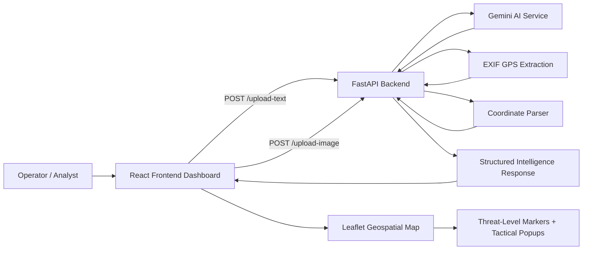

# Sentinals Geospatial Intelligence Dashboard


Sentinals is an AI-powered geospatial intelligence platform that transforms raw field data into actionable operational insight.

It combines:
- AI analysis for field reports and surveillance images
- automatic coordinate extraction (EXIF + AI text parsing)
- live map visualization with threat-level markers

## Project Boost: Why This Is Strong

This project is more than a dashboard UI. It demonstrates full-stack intelligence workflow design:
- ingestion of unstructured multi-modal inputs (text + imagery)
- AI-driven semantic analysis
- geospatial interpretation and plotting
- tactical monitoring in a real-time operational interface

In short: it reduces analysis latency from raw data to map-ready intelligence.

## How It Helps in Real Scenarios

- Faster triage: analysts can process text and images in one place.
- Better situational awareness: extracted coordinates are immediately visible on a tactical map.
- Improved decision support: threat labeling and structured outputs make reports easier to prioritize.
- Field-to-command continuity: raw observations are converted into command-readable intelligence summaries.

## Clean Project Layers

The system naturally follows a layered architecture.

### 1) Presentation Layer (UI)
Location: dashboard-frontend/

Responsibilities:
- Collect operator inputs (field report text, surveillance image)
- Display AI analysis in a readable tactical panel
- Render geospatial markers with threat-based visual coding

### 2) Application Layer (API Orchestration)
Location: dashboard-backend/main.py

Responsibilities:
- Expose HTTP endpoints
- Route requests to AI and coordinate extraction logic
- Normalize payloads returned to the frontend

### 3) Intelligence Layer (AI Reasoning)
Location: dashboard-backend/main.py (Gemini integration)

Responsibilities:
- Prompt and interpret Gemini responses for text and image inputs
- Generate structured tactical analysis and threat insights

### 4) Geospatial Layer (Location Extraction + Mapping)
Location: backend extraction functions + frontend Leaflet map

Responsibilities:
- Extract GPS from EXIF when present
- Parse coordinates from AI text when EXIF is unavailable
- Plot markers and provide map popups for fast operational context

## End-to-End Flow

1. Operator submits text report or surveillance image.
2. FastAPI endpoint receives and validates input.
3. Backend runs AI analysis and coordinate extraction.
4. Response returns structured intelligence + location.
5. Frontend displays analysis and places marker on map.

## Architecture Diagram



## Tech Stack

Frontend:
- React 19 (Create React App)
- Leaflet + React Leaflet

Backend:
- FastAPI
- Google Generative AI SDK (Gemini: gemini-2.5-flash)
- exifread

## Repository Structure

sentinals-dashboard/
- dashboard-frontend/    React client (UI + map visualization)
- dashboard-backend/     FastAPI backend (API + AI orchestration)
- README.md              Project documentation

## API Surface

Base URL: http://localhost:8000

- GET /
  - Service banner endpoint
- GET /health
  - Service health and capability flags
- GET /test-gemini
  - Gemini connectivity check
- POST /upload-text
  - Input: form field report
  - Output: AI analysis + optional coordinates
- POST /upload-image
  - Input: form field image
  - Output: AI analysis + EXIF/parsed coordinates
- POST /batch-analysis
  - Input: form field reports list
  - Output: per-report processing results
- GET /intelligence-summary
  - Operational system capability summary

## Quick Start

### Prerequisites
- Node.js 18+
- npm 9+
- Python 3.10+

### 1) Clone

```bash
git clone https://github.com/abhiraamadiga/sentinals-dashboard.git
cd sentinals-dashboard
```

### 2) Run Backend

Windows (PowerShell):

```powershell
cd dashboard-backend
py -m venv .venv
.\.venv\Scripts\Activate.ps1
pip install fastapi uvicorn google-generativeai exifread python-multipart
uvicorn main:app --reload --host 0.0.0.0 --port 8000
```

macOS/Linux:

```bash
cd dashboard-backend
python3 -m venv .venv
source .venv/bin/activate
pip install fastapi uvicorn google-generativeai exifread python-multipart
uvicorn main:app --reload --host 0.0.0.0 --port 8000
```

### 3) Run Frontend

```bash
cd dashboard-frontend
npm install
npm start
```

Access:
- Frontend: http://localhost:3000
- Backend: http://localhost:8000

## Security Note

The current backend file contains a hardcoded Gemini API key. Move it to an environment variable immediately before sharing or deploying.

Recommended environment variable:

```env
GEMINI_API_KEY=your_key_here
```

## Current Limitations

- Backend is currently implemented as a single-file service.
- If coordinates are missing, frontend falls back to randomized map points.
- Threat extraction depends on regex matching in generated AI text.

## Suggested Next Milestone (Clean Layer Upgrade)

To make this production-grade, split backend into clear modules:

- app/api/routes.py
- app/services/ai_service.py
- app/services/geospatial_service.py
- app/models/schemas.py
- app/core/config.py

This keeps routing, AI logic, geo logic, and config isolated, testable, and scalable.

## Screenshots and Demo

Use this section to make your GitHub page visually compelling for reviewers and recruiters.

### Live Demo

- Demo URL: add your deployed link here
- Demo video: add YouTube or Loom walkthrough link here

### Recommended Screenshots

1. Dashboard overview with map and analysis panels
2. Text report submission and AI output
3. Image upload result with coordinates and threat marker
4. Multiple intelligence points on map with threat color coding

### Screenshot Template

```md
## Screenshots

### Dashboard Overview


### Text Intelligence Analysis


### Image Intelligence Analysis


### Geospatial Threat Mapping

```

Tip: Create a docs/screenshots folder in the repository and keep image names consistent.

## Why This Project Stands Out in a Portfolio

- Demonstrates multi-modal AI integration (NLP + vision)
- Shows geospatial intelligence UX, not just text output
- Connects backend AI orchestration with frontend operational tooling
- Highlights real-world defense/security analytics thinking

## License

No license file is currently present in the repository root. Add one before public distribution.